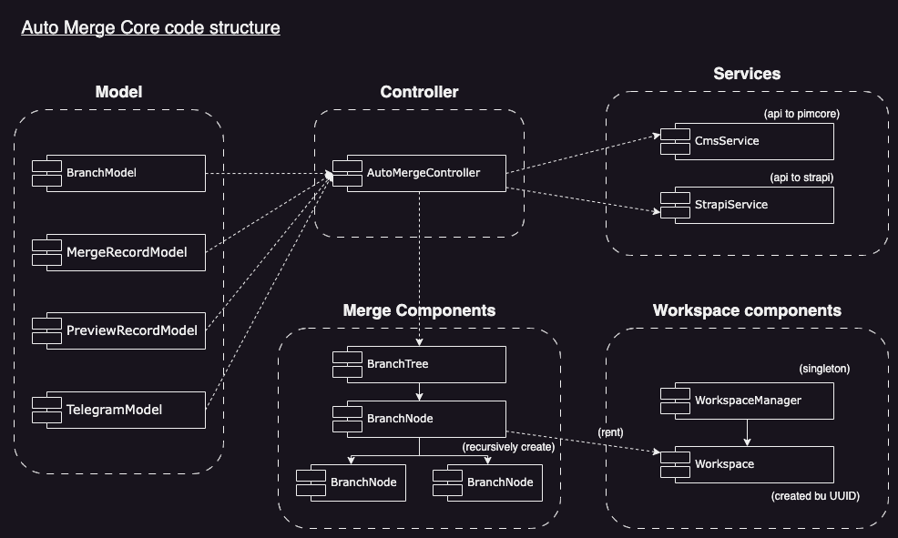
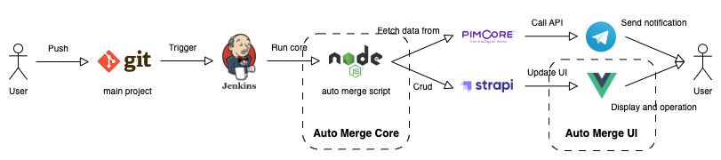

## Auto Merge core

- written in node.js
- process git merge
- send api to database to save merge result

### Structure

---



**Controller:**

- AutoMergeController - the main controller of the program, it will instantnize models, services and merge components and manage the logic about auto-merge

**Model:**

- BranchModel - model to store branch table retrieved from Strapi (cms backend)
- MergeRecordModel - model to keep merge success and fail in record
- PreviewRecordModel - model to keep each branch latest and previous commit hash
- TelegramModel - model to store all telegram data get from CMS, also have some methods about getting difference type of telegram chat_id e.g. getChatIdByStaffCodeArr

**Service:**

- CmsService - service to communicate with pimcore
- StrapiService - service to communicate with Strapi (cms backend)

**Merge Components:**

- BranchTree - component for branch tree, create root node
- BranchNode - component for branch node, used for create all children node and do merge propagation

**Workspace Components:**

- WorkspaceManager - a singleton component for create and manage workspace instances, provide methods for BranchNode to:
    - rent a workspace for merge process
    - release workspace after merge process is finished
- Workspace - an instance for merge process
    - use simpleGit package to run git related command (fetch, pull, merge)

---

### Installation

Use npm to install packages

```jsx
npm install
```

---

### Usage

**With .env**

.env example: 

```jsx
// Create .env file in project root directory

// <ProjectRoot>/.env

GIT_USERNAME='user'
GIT_PASSWORD='password'
TARGET_GIT_PATH='https://gitlab.com/user/abc.git'
CMS_HOST='http://xxx.com'
ROOT_BRANCH='root'
```

Run on powershell or bash:

```jsx
node index.js
```

**Environment variable:**

- GIT_USERNAME (The username of your git repository access)
- GIT_PASSWORD (The password of your git repository access)
- TARGET_GIT_PATH (The git repository path that you want to do the auto merge)
- CMS_HOST (The url path that can access frontend CMS)
- ROOT_BRANCH (The root branch of the auto merge process)

**Without .env**

- Run the command with arguments

Run on powershell:

```jsx
$ROOT_BRANCH=production; $CMS_HOST=http://xxx.com; $TARGET_GIT_PATH=https://gitlab.com/user/abc.git; $env:GIT_USERNAME=user; $env:GIT_PASSWORD='password'; node index.js
```

Run on bash:

```jsx
Run on bash:

ROOT_BRANCH=production CMS_HOST=http://xxx.com TARGET_GIT_PATH=https://gitlab.com/user/abc.git GIT_USERNAME=user GIT_PASSWORD=password node index.js
```

---

## Full diagram of auto merge core / UI, frontend tools and CMS

