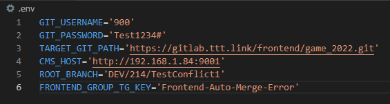
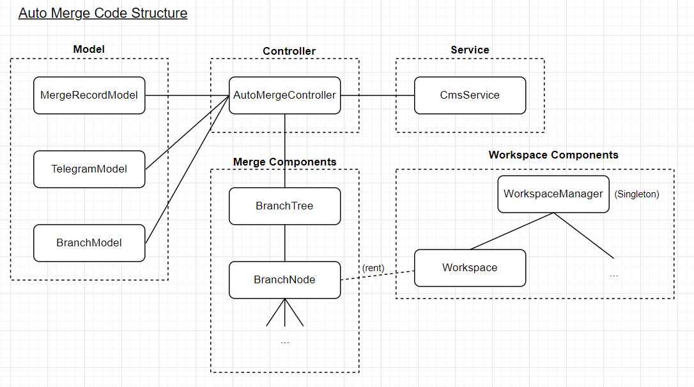
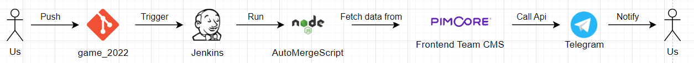

# Auto Merge

This project is about auto merge script written in node.js. 

## How to use?

### If no .env file support

```
Run on powershell:

$ROOT_BRANCH=QA/Package; $CMS_HOST=http://192.168.1.84:9001; $TARGET_GIT_PATH=https://gitlab.ttt.link/frontend/game_2022.git; $env:GIT_USERNAME=900; $env:GIT_PASSWORD='Password'; node index.js

Run on bash:

ROOT_BRANCH=QA/Package CMS_HOST=http://192.168.1.84:9001 TARGET_GIT_PATH=https://gitlab.ttt.link/frontend/game_2022.git GIT_USERNAME=900 GIT_PASSWORD=Password node index.js
```

### If .env is supported

```
// Create .env file in project root directory

// <ProjectRoot>/.env

GIT_USERNAME='900'
GIT_PASSWORD='Password'
TARGET_GIT_PATH='https://gitlab.ttt.link/frontend/game_2022.git'
CMS_HOST='http://192.168.1.84:9001'
ROOT_BRANCH='QA/Package'
FRONTEND_GROUP_TG_KEY='Frontend-Auto-Merge-Error'
```

```
Run on powershell or bash:

node index.js
```

### Overview
1. Setup the environment variable that program needed by copy .env-example in root directory and rename it to .env. There are following configs in .env
- GIT_USERNAME (The username of your git repository access)
- GIT_PASSWORD (The password of your git repository access)
- TARGET_GIT_PATH (The git repository path that you want to do the auto merge, e.g. Game_2022)
- CMS_HOST (The url path that can access frontend CMS)
- ROOT_BRANCH (The root branch of the auto merge process)
- FRONTEND_GROUP_TG_KEY (The frontend group telegram key stored in frontend CMS, used to send merge conflict message to this key refers to)
    
    
    
2. Run ‘npm install’ in root directory
3. Run ‘node index.js’ in root directory to start the auto-merge process

## Code Concepts



**Controller:**

- AutoMergeController - the main controller of the program, it will instantize models, services and merge components and manage the logic about auto-merge

**Model:**

- MergeRecordModel - model to keep merge success and fail in record
- TelegramModel - model to store all telegram data get from CMS, also have some methods about getting difference type of telegram chat_id e.g. getChatIdByStaffCodeArr
- BranchModel - model to store branch table retrieved from CMS

**Service:**

- CmsService - service to communicate with frontend CMS

**Merge Components:**

- BranchTree - component for branch tree, create root node
- BranchNode - component for branch node, used for create all children node and do merge propagation

**Workspace Components:**

- WorkspaceManager - a singleton component for create and manage workspace instances, provide methods for BranchNode to:
    - rent a workspace for merge process
    - release workspace after merge process is finished

## Full picture and flow for auto merge script and frontend server/tools



## Material

- Draw IO
    
    [AutoMerge-2.drawio](readmeSrc/AutoMerge-2.drawio)
    
    [AutoMerge-3-UI.drawio](readmeSrc/AutoMerge-3-UI.drawio)
    

**Modified Date: 3/2/2022**

**Created Date: 26/1/2022**